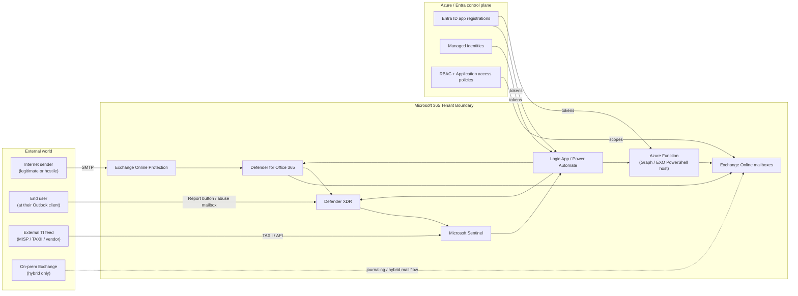
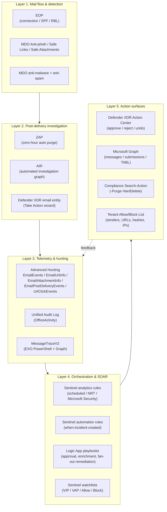
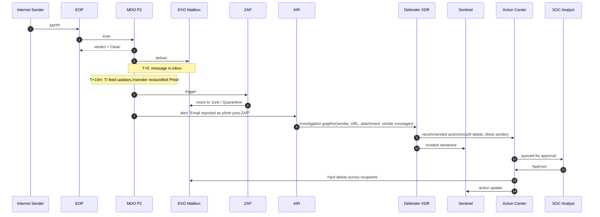
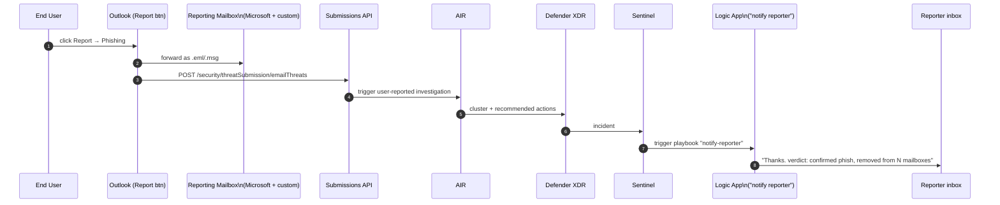
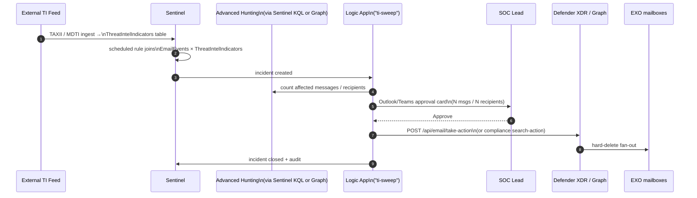
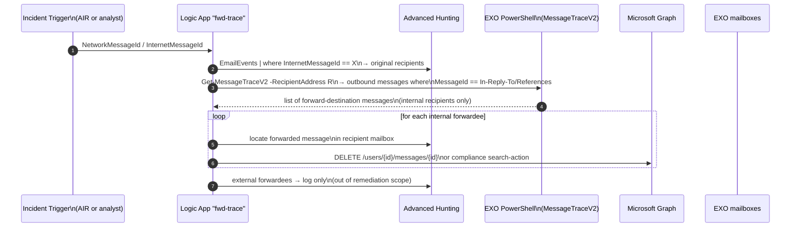
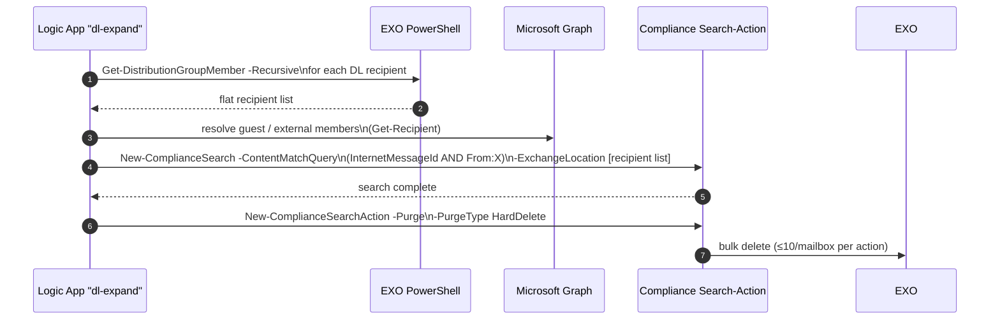
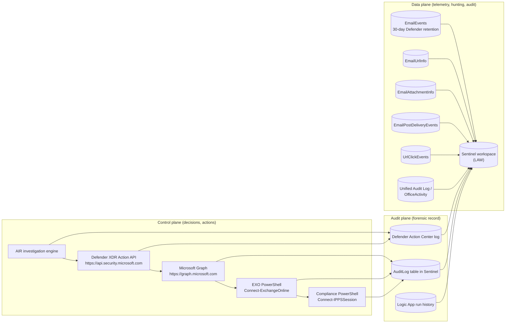
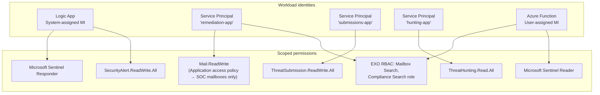

# Target-State Architecture Overview

The reference architecture diagram set. Read this before the deeper docs;
every component here is expanded later.

## 1. System context

What runs inside the tenant, what does not, and where the trust boundaries
sit.

**Trust boundaries**

| Boundary | Crossing rule |
|---|---|
| Internet → EOP | All inbound mail terminates here. SPF/DKIM/DMARC enforced at this layer. |
| EOP → MDO → EXO | Internal handoff inside the tenant. MDO verdicts attach as message headers. |
| EXO ↔ Defender XDR | Telemetry one way (EmailEvents to XDR); actions other way (Take Action → mailbox). |
| Defender XDR ↔ Sentinel | Streaming connector; bidirectional incident sync. |
| Sentinel → Logic Apps → Graph / EXO | All remediation passes through a managed-identity-authenticated Logic App or Function. |
| External TI → Sentinel | TAXII / Defender TI / custom Logic App ingestion. Indicator confidence scored on ingest. |

---

## 2. Logical layered architecture

The system has five logical layers. Every TRAP capability that we replicate
maps onto a layer transition.

---

## 3. The five canonical workflows

Every TRAP capability maps to one of these five orchestrated workflows in the
target architecture. Each is decomposed below.

### Workflow A: Reactive remediation from MDO/AIR detection

The "always-on" path: MDO catches a phish post-delivery, AIR investigates,
recommended actions go to Action Center, Sentinel mirrors the incident.

**Notes**

* Step 6: ZAP is autonomous. no analyst in the loop.
* Step 7 to 8: AIR is autonomous; only the recommended action queue requires
  human approval (configurable: some actions can be set to auto-apply).
* Step 11 to 12: bulk hard-delete uses Compliance Search-Action under the hood;
  see [`07-graph-and-exchange-remediation.md`](./07-graph-and-exchange-remediation.md).

---

### Workflow B: User-reported phishing (the TRAP/CLEAR equivalent)

* Built-in pre-report banner is configurable in
  *Defender → Settings → Email & collaboration → User reported*.
* Verdict-back notification is **not** native; the Logic App at step 7
  closes the loop. Logic App design in
  [`10-logic-apps-playbook-library.md`](./10-logic-apps-playbook-library.md).

---

### Workflow C: TI-driven retroactive sweep (the IOC hunt-and-purge case)

This is the closest functional analogue to TRAP's IOC-driven mass-pull. KQL
hunt query in [`09-kql-detection-library.md`](./09-kql-detection-library.md).

---

### Workflow D: Forward-following remediation

The "this phish was forwarded to four other people, including external" case.

External forward following is the **fundamental gap**: Once mail leaves the
tenant boundary, Microsoft has no telemetry. TRAP, similarly, can only
follow forwards inside customers it integrates with. We log and alert; we do
not pretend to remediate. Mitigations in
[`12-limitations-and-gaps.md`](./12-limitations-and-gaps.md).

---

### Workflow E: Distribution-list expansion

The 10-item-per-mailbox limit on Compliance Search-Action is the gotcha here.
For large campaigns the playbook must loop the action; alternatively, the
Defender XDR Take Action wizard handles this transparently for messages
matched by `NetworkMessageId`. Tradeoff in
[`07-graph-and-exchange-remediation.md`](./07-graph-and-exchange-remediation.md).

---

## 4. Data flow: how telemetry, control, and audit flow

**Sizing notes**

* `EmailEvents` ≈ 1 to 4 KB per row × messages-per-day. A 10k-mailbox tenant
  averages 200 to 500 k inbound messages/day → 0.4 to 2 GB/day in this single
  table. `EmailUrlInfo` and `UrlClickEvents` add another 1 to 3 GB/day combined.
* `OfficeActivity` (audit log) ≈ 0.5 to 2 GB/day per 10k-user tenant.
* Plan a Sentinel workspace at **3-month retention** for these tables, with
  long-term retention to Azure Data Explorer / Log Analytics archive tier
  for compliance windows beyond 90 days.

---

## 5. Component matrix

Every component, what it does, what document expands it.

| Component | Role in TRAP-equivalent | Detail document |
|---|---|---|
| EOP | Gateway filtering (was Proofpoint EOP / TAP gateway role) | [`04-mdo-native-capabilities.md`](./04-mdo-native-capabilities.md) |
| MDO P2 | Detection: Safe Links, Safe Attachments, anti-phish, Campaigns view | [`04-mdo-native-capabilities.md`](./04-mdo-native-capabilities.md) |
| ZAP | Post-delivery autonomous purge (was TRAP's auto-pull on TAP verdict) | [`05-defender-xdr-air-zap.md`](./05-defender-xdr-air-zap.md) |
| AIR | Investigation graph + recommended actions (was TRAP incident workflow) | [`05-defender-xdr-air-zap.md`](./05-defender-xdr-air-zap.md) |
| Defender XDR | Unified incident, email entity, Take Action (was TRAP UI) | [`05-defender-xdr-air-zap.md`](./05-defender-xdr-air-zap.md) |
| Submissions API | Programmatic submit-and-act (was TRAP API) | [`08-abuse-mailbox-and-user-reporting.md`](./08-abuse-mailbox-and-user-reporting.md) |
| Built-in Outlook Report btn | Reporter input (was PhishAlarm) | [`08-abuse-mailbox-and-user-reporting.md`](./08-abuse-mailbox-and-user-reporting.md) |
| Custom abuse mailbox | Optional ingestion path (was TRAP abuse mailbox) | [`08-abuse-mailbox-and-user-reporting.md`](./08-abuse-mailbox-and-user-reporting.md) |
| Sentinel | SIEM, automation rules, watchlists (was Splunk/QRadar + TRAP integration) | [`06-sentinel-soar-orchestration.md`](./06-sentinel-soar-orchestration.md) |
| Logic Apps | Playbooks (was TRAP custom workflow + 3rd-party SOAR) | [`10-logic-apps-playbook-library.md`](./10-logic-apps-playbook-library.md) |
| Microsoft Graph | Programmatic email/submission/TABL access | [`07-graph-and-exchange-remediation.md`](./07-graph-and-exchange-remediation.md) |
| EXO PowerShell | Compliance Search-Action, MessageTraceV2, DL expansion | [`07-graph-and-exchange-remediation.md`](./07-graph-and-exchange-remediation.md) |
| Tenant Allow/Block List | TI-driven block (was TRAP blocklists) | [`04-mdo-native-capabilities.md`](./04-mdo-native-capabilities.md) |
| Action Center | Approval surface (was TRAP approval queue) | [`05-defender-xdr-air-zap.md`](./05-defender-xdr-air-zap.md) |
| Watchlists | VIP / VAP / known-bad sender (was TRAP user prioritization) | [`06-sentinel-soar-orchestration.md`](./06-sentinel-soar-orchestration.md) |

---

## 6. Identity & authorisation model

Every action surface needs a credential. Use the matrix below to design
least-privilege.

**Least-privilege rules**

1. **Application access policies** scope `Mail.ReadWrite` to a security group
   that only contains SOC-relevant mailboxes (e.g. service mailboxes). Never
   grant tenant-wide `Mail.ReadWrite` to a remediation app.
2. **Separation**: do not reuse the submissions service principal for hunt
   queries or for remediation. Per-purpose SPs make audit + revocation easy.
3. **EXO Application access policy** (`New-ApplicationAccessPolicy`) is the
   only modern way to limit Graph mail scope per service principal.
4. **Compliance Search-Action** requires the EXO + Compliance "eDiscovery
   Manager" role *plus* the "Compliance Search" role. Use a dedicated
   security group; assign the SP via `Add-RoleGroupMember`.
5. **Connect-ExchangeOnline -ManagedIdentity** is supported from Exchange
   Online Management module v3+; prefer it over certificate-based app-only
   for any in-Azure Function host.

---

## 7. Failure modes by design

What breaks, what we do about it.

| Failure | Detection | Mitigation |
|---|---|---|
| Logic App run fails mid-fan-out | Sentinel workbook on `AzureDiagnostics \| where Resource startswith "playbook-"` | Idempotent design: each remediation step keyed by `NetworkMessageId + RecipientAddress`; replay-safe. |
| Compliance Search-Action stuck in "InProgress" > 30 min | Function App polling `Get-ComplianceSearch` status | Cancel and recreate after 60 min; alert SOC. |
| Graph throttled (429) | Logic App "On error" branch on the HTTP action | Honour `Retry-After` header; exponential backoff; degrade to Compliance Search-Action path. |
| AIR queue saturated (concurrent investigation cap) | Defender XDR alert "AIR investigation queue depth high" + Sentinel rule | Sentinel scheduled hunting picks up the slack; manual Take Action wizard. |
| ApplicationImpersonation removed but legacy script still uses EWS | Sentinel rule on AzureAD audit `application removed` + EWS HTTP 401 telemetry from Function App logs | Replace with Graph + RBAC application policy (this blueprint assumes done). |
| Approver out of office, approval card never answered | Logic App timeout on Approval action (default 30d, override to 1h) | Escalate to Teams channel @SOC group; auto-approve after 4h for confirmed-malicious-by-Defender verdicts only. |

---

## 8. Where to read next

* **Capability mapping**: [`03-trap-capability-matrix.md`](./03-trap-capability-matrix.md)
* **What MDO does on its own**: [`04-mdo-native-capabilities.md`](./04-mdo-native-capabilities.md)
* **Action engine internals**: [`05-defender-xdr-air-zap.md`](./05-defender-xdr-air-zap.md)
* **SOAR design**: [`06-sentinel-soar-orchestration.md`](./06-sentinel-soar-orchestration.md)
* **API/PowerShell-level remediation**: [`07-graph-and-exchange-remediation.md`](./07-graph-and-exchange-remediation.md)
* **User-report ingestion**: [`08-abuse-mailbox-and-user-reporting.md`](./08-abuse-mailbox-and-user-reporting.md)
* **KQL library**: [`09-kql-detection-library.md`](./09-kql-detection-library.md)
* **Playbook library**: [`10-logic-apps-playbook-library.md`](./10-logic-apps-playbook-library.md)
* **Migration plan**: [`11-implementation-roadmap.md`](./11-implementation-roadmap.md)
* **What we cannot do**: [`12-limitations-and-gaps.md`](./12-limitations-and-gaps.md)
* **What it costs**: [`13-licensing-and-operations.md`](./13-licensing-and-operations.md)
