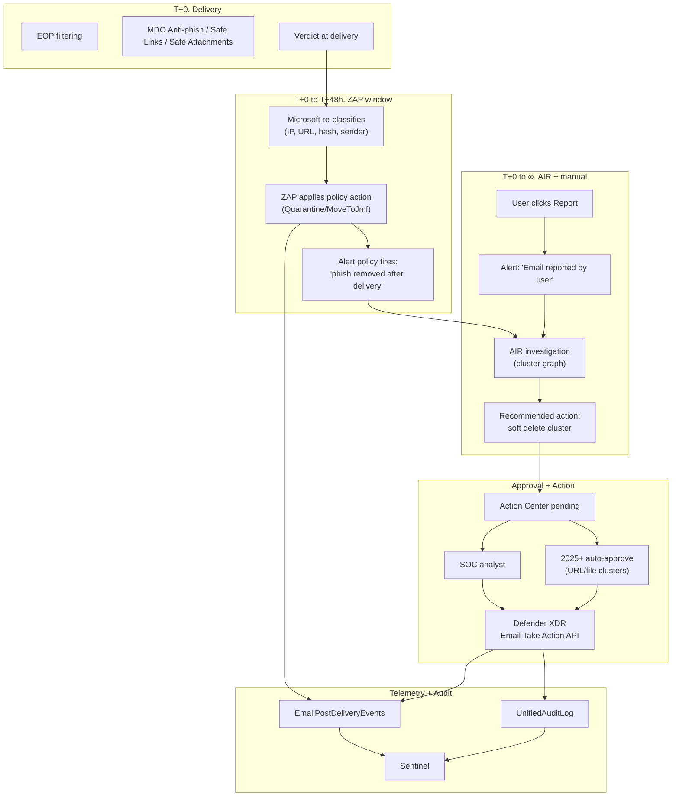

# Defender XDR, AIR, and ZAP: Action Engine Internals

> The "what fires what" reference for the Microsoft action engine that
> replaces our TRAP auto-pull worker. Three distinct subsystems:
> ZAP (autonomous purge), AIR (autonomous investigation plus recommended
> action), Defender XDR (unified incident, take-action API, Action Center).

---

## 1. ZAP: Zero-hour Auto Purge

Source: [`zero-hour-auto-purge`](https://learn.microsoft.com/en-us/defender-office-365/zero-hour-auto-purge).

### What ZAP is

ZAP is **post-delivery, signature/verdict-driven retroactive remediation**.
It runs continuously inside Exchange Online. When Microsoft's filters
re-classify a sender, URL, or attachment after delivery, ZAP retroactively
applies the policy-configured action to copies still resident in cloud
mailboxes.

### Critical limits

| Limit | Value | Implication for TRAP-replacement |
|---|---|---|
| **Eligibility window** | **48 hours** post-delivery (hardcoded) | TRAP has no equivalent ceiling. For >48 h sweeps we must use Compliance Search-Action or Defender XDR Take Action API. |
| Mailbox class | **Cloud mailboxes only** | On-prem hybrid mailboxes are not ZAP-eligible. |
| Action source | Microsoft re-classification *or* admin-submission verdict change | User reports trigger ZAP indirectly via the AIR pipeline. |
| Audit visibility | **Not in EXO mailbox audit log as system action** | Use Threat Explorer's `Additional action = ZAP` filter or the Email entity Timeline. |

### Per-verdict ZAP behaviour

| Verdict | Read state | ZAP behaviour | Configurable in |
|---|---|---|---|
| Malware | read or unread | **Always quarantines** (admin-only release) | Anti-malware policy (default ON) |
| High-confidence phish | read or unread | **Always quarantines** (admin-only release) | Anti-phish policy |
| Phish | read or unread | Action **follows policy `PhishSpamAction`**: `Quarantine`/`MoveToJmf` apply; `AddXHeader`/`PrependSubject`/`Redirect`/`Delete` are no-ops | Anti-spam policy |
| Spam / HC spam | unread only | Same conditional behaviour as Phish | Anti-spam policy |

### ZAP does not fire when

* Mailbox is on-prem (not in EXO).
* Active TABL **allow** entry (default 45 d after admin submission) overrides.
* Mail-flow rule SCL override pushes to allow.
* Recipient is in Advanced Delivery **SecOps mailboxes** (skip Malware + HC-Phish ZAP) or **Phish Sim overrides**.
* MX is pointed elsewhere with a "bypass spam filtering" mail-flow rule (HC-phish ZAP override).
* During Safe Attachments **dynamic delivery** detonation (falls back to Move-to-Junk if a phish/spam signal arrives mid-detonation).

### Operational guidance

* Leave ZAP on. Disabling it is one of the most common configuration mistakes.
* Use Sentinel rule on `EmailPostDeliveryEvents | where ActionType has "ZAP"`
  for visibility. ZAP isn't in the EXO audit log.
* For >48 h IOC-driven retroactive sweeps, use the Sentinel TI sweep
  playbook (Workflow C in [`02-architecture-overview.md`](./02-architecture-overview.md)).

---

## 2. AIR Automated Investigation and Response

Source: [`air-about`](https://learn.microsoft.com/en-us/defender-office-365/air-about),
[`air-remediation-actions`](https://learn.microsoft.com/en-us/defender-office-365/air-remediation-actions),
[`air-user-automatic-feedback-response`](https://learn.microsoft.com/en-us/defender-office-365/air-user-automatic-feedback-response).

### What AIR is

AIR is the **autonomous investigation + recommendation engine** that fires
on a defined set of MDO P2 alerts. For each alert, it builds an
investigation graph that:

* Pivots on email cluster signals (subject hash, sender P1/P2, sender IP,
  URL host/path, attachment SHA256, Microsoft fingerprint matching).
* Enumerates all matching recipients across the tenant via mail-flow telemetry.
* Evaluates current verdict per cluster.
* Recommends a remediation action. historically queued for SOC approval in
  Action Center; in 2025+, Microsoft has GA'd full **auto-approval** of
  malicious URL-cluster and file-cluster remediations (eliminating the
  approval step for those scenarios).

### Triggers (alert policies that auto-launch AIR)

The alert policy must have **`Automated investigation = Yes`** (default for
the policies listed below). Source: [`alert-policies §threat-management`](https://learn.microsoft.com/en-us/defender-xdr/alert-policies#threat-management-alert-policies).

| Alert | AIR fires? | Notes |
|---|---|---|
| Email reported by user as malware or phish | **Yes** | The CLEAR-equivalent trigger. **Auto-Resolve tuning rule may suppress**: disable if needed. |
| ZAP. phish/malware removed after delivery | **Yes** | AIR investigates the cluster |
| A potentially malicious URL click was detected | **Yes** | Safe Links click on known-bad URL |
| Suspicious mailbox behaviour (compromised user) | **Yes** | Pivots into mailbox compromise playbook |
| User restricted from sending email | **Yes** | Outbound compromise indicator |
| Suspicious email forwarding activity | **Yes** | Detects auto-forward rule abuse |
| Suspicious email-sending patterns detected | **Yes** | Outbound spam detection |

### Manual AIR triggers

* **Defender portal "Take action" wizard**: from Threat Explorer, Email
  entity, Email summary panel, Advanced Hunting result row, Custom
  detection rule → choose *Initiate automated investigation*.
* **Submissions → User reported tab**: select row → *Submit to Microsoft for
  analysis → Trigger investigation*.
* **No public `Trigger-AIRInvestigation` cmdlet and no Graph endpoint.**
  Programmatic trigger requires submitting via Graph
  `/security/threatSubmission/emailThreats` so the alert fires AIR, **or**
  using the Defender XDR Take Action API which also accepts an
  `initiateAutomatedInvestigation` action.

### Recommended actions (the action surface)

| Finding | Recommended action | Auto-applied? |
|---|---|---|
| Malware in email | **Soft delete email/cluster** | 2025+ for malicious file similarity clusters |
| Malicious URL (Safe Links) | Soft delete email/cluster + Block URL at TOC | 2025+ for malicious URL similarity clusters |
| Phishing | Soft delete email/cluster | Pending approval |
| Phish removed by ZAP | Soft delete email/cluster | Pending approval |
| User-reported phish | Investigation playbook | Pending approval |
| Suspicious forwarding | Remove forwarding rule | Pending approval |
| Email delegation | Remove delegations | Pending approval |
| User clicked malicious URL | No pending email action; block at TOC | n/a |

> **Critical limitation**: AIR's email auto-actions are **soft delete only**.
> There is no auto hard-delete, no auto move-to-junk, no auto block-sender
> from AIR. Hard delete and TABL block must come from manual Take Action
> wizard or Compliance Search-Action.

### Cross-recipient remediation

Yes, when AIR (or its manual analog Take Action) acts on a cluster, it
applies **across all recipients in the tenant**, not just the original
recipient. This is the canonical TRAP-replacement primitive.

### Auto Feedback Response (verdict back to reporter)

AIR can email the reporter with the investigation verdict. Configured at
*Defender → Settings → Email & collaboration → User reported → Automatically
email users the results of the investigation*. Toggles per verdict
(Phishing/malware, Spam, No threats found). Sender:
`submissions@messaging.microsoft.com` (customisable). Logo:
customisable to tenant brand.

**Caveat**: not sent if the message was already remediated before AIR ran
(investigation closes as Remediated with no pending actions). For the
TRAP-grade guarantee of always-thank-the-reporter, supplement with a
Logic App that subscribes to the user-reported alert and sends a
thank-you regardless. See playbook P3 in
[`10-logic-apps-playbook-library.md`](./10-logic-apps-playbook-library.md).

### Permissions for AIR/Action Center email actions

Required: **Security Administrator** (Entra) **AND** an Email & collaboration
role group containing the **Search and Purge** role (default: Data
Investigator and Organization Management). Under Defender XDR Unified RBAC,
the equivalent is **Security operations / Email advanced remediation actions
(manage)**.

### Concurrent investigation cap

Microsoft does not publish a numeric cap. Field-observed behaviour is that
AIR queues fall behind during campaign storms (>50 simultaneous
investigations). Plan SOAR retries with 5 to 15 min jitter. Sentinel scheduled
hunting picks up the slack. see [`09-kql-detection-library.md`](./09-kql-detection-library.md) Q5.

---

## 3. Defender XDR. Email Take Action API

Source: [`api-overview`](https://learn.microsoft.com/en-us/defender-xdr/api-overview),
[`advanced-hunting-take-action`](https://learn.microsoft.com/en-us/defender-xdr/advanced-hunting-take-action),
[`remediate-malicious-email-delivered-office-365`](https://learn.microsoft.com/en-us/defender-office-365/remediate-malicious-email-delivered-office-365).

### Endpoint base

`https://api.security.microsoft.com` for Defender-XDR-specific operations
(non-Graph). Email take-action is exposed under the email-actions surface
and reachable from Logic Apps via the Defender XDR connector or HTTP +
managed identity.

### Action types

| Action | Behaviour | Source-of-truth column needed |
|---|---|---|
| **Move to Inbox** | Restores from Junk/Quarantine/Deleted | None |
| **Move to Junk** | ZAP-style move | None |
| **Move to Deleted Items** | Soft visibility removal | None |
| **Soft delete** | Move to Recoverable Items \ Deletions; user/admin can recover. **Auto-cleans the sender's Sent Items copy for intra-org / outbound mail** (requires `EmailDirection`, `SenderFromAddress` columns in source query) | EmailDirection + SenderFromAddress |
| **Hard delete** | Purge from Recoverable Items + corresponding calendar entry; admin recovery only via single-item recovery if enabled | None |
| **Submit to Microsoft** | Post to Submissions; can simultaneously add URLs/domains/file hashes to TABL | None |
| **Initiate automated investigation** | Trigger AIR on email/sender/recipient | None |

### Non-actionable locations

These mailbox/folder states are silently skipped by remediation:

* Hard-deleted folder (already purged)
* On-prem / external mailbox
* Failed/dropped delivery
* Unknown delivery state

### Critical limits (Defender XDR Email take-action API)

| Limit | Value |
|---|---|
| Concurrent active email remediations (org-wide) | **50** |
| Single remediation hard cap | **1 000 000 messages** |
| Recipient-coverage rule | Selected recipients ≥ **40 %** of message count, **OR** per-recipient delete cap = **1 000** messages |
| Recommended batch size | **≤ 50 000** messages |
| Threat Explorer query-select cap | **200 000** messages per remediation |
| Threat Explorer handpicked cap | **100** messages |

### Action Center

Path: `https://security.microsoft.com/action-center`. Two tabs:

* **Pending actions**: recommended-but-not-yet-approved actions from AIR.
  Approve / Reject one-at-a-time or in bulk for same-action-type batches.
* **History**: every taken action (manual or auto). Source column values:
  *Manual email action*, *Automated email action*, *Explorer action*,
  *Advanced hunting action*, *Custom detection action*. Retention:
  **30 days in UI**; longer via Audit Log / Sentinel `OfficeActivity`.

Undo: supported for soft-delete actions within the 30-day window via the
History tab.

### Defender XDR Unified RBAC scopes for take-action

| Scope | Required for |
|---|---|
| `Security operations / Security data / Security data basics (read)` | Read incidents/alerts |
| `Security operations / Response (manage)` | Approve/reject actions, run playbooks |
| `Email & collaboration / Email advanced remediation actions (manage)` | Hard delete, move-to-folder, submit |
| `Email & collaboration / Email content (read)` | Preview / download `.eml` |

---

## 4. How the three layers interact

**Key design insight**: ZAP is the "no-human-needed" autonomous cleanup
inside the 48 h window. AIR is the "human-approves-recommendation" engine
that handles user reports and >48 h scenarios via cluster graphs. The
Defender XDR Take Action API is the action surface both layers ultimately
call, and is also what our SOAR (Sentinel + Logic Apps) calls when
neither ZAP nor AIR can act (e.g. external TI feed sweep, hybrid mailbox
remediation orchestration).

---

## 5. What the SOAR layer adds on top

Sentinel + Logic Apps wraps these three engines to provide:

* **Approval workflows** with VIP/VAP-aware routing (Action Center is
  one-size-fits-all).
* **TI-driven retroactive sweeps** beyond the 48 h ZAP window.
* **Reporter "thanks" + verdict-back** for the case where AIR's auto-feedback
  doesn't fire (already-remediated messages).
* **DL expansion + forward-following** with Compliance Search-Action
  fan-out.
* **Cross-system enrichment** (VirusTotal, MDTI, AbuseIPDB) before action.
* **Audit and reporting** beyond the Action Center 30-day window.

Detailed in [`06-sentinel-soar-orchestration.md`](./06-sentinel-soar-orchestration.md)
and [`10-logic-apps-playbook-library.md`](./10-logic-apps-playbook-library.md).
