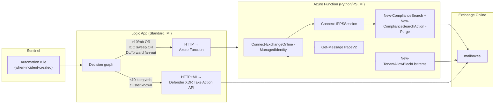

# Microsoft Graph and Exchange Online: Programmatic Remediation Reference

> The data plane for the TRAP-replacement architecture. Three remediation
> APIs, three permission models, three sets of limits, and one critical
> identity migration (the ApplicationImpersonation removal, March 2025).
> Defender XDR Take Action API is in
> [`05-defender-xdr-air-zap.md`](./05-defender-xdr-air-zap.md); this
> document covers Microsoft Graph email APIs, EXO PowerShell, Compliance
> Search-Action, and the identity model that ties them together.

---

## 1. Microsoft Graph for email

### 1.1 Endpoints

| Operation | Endpoint | Permission (least-privileged) |
|---|---|---|
| List/get message | `GET /users/{id}/messages` , `GET /users/{id}/messages/{id}` | `Mail.Read` (app or delegated) |
| Get message read state | `GET /users/{id}/messages/{id}?$select=isRead` | `Mail.Read` |
| Soft delete (to Deleted Items) | `DELETE /users/{id}/messages/{id}` | `Mail.ReadWrite` |
| Move to Recoverable Items \ Deletions | `POST /users/{id}/messages/{id}/move` with `destinationId: recoverableitemsdeletions` | `Mail.ReadWrite` |
| Permanent delete | `POST /users/{id}/messages/{id}/permanentDelete` (where available) | `Mail.ReadWrite` |
| Submit threat | `POST /beta/security/threatSubmission/emailThreats` | `ThreatSubmission.ReadWrite.All` |
| Run hunting query | `POST /security/runHuntingQuery` | `ThreatHunting.Read.All` |
| Get/list threat indicators | `GET /security/tiIndicators` | `ThreatIndicators.ReadWrite.OwnedBy` |

### 1.2 Constraining `Mail.ReadWrite` blast radius

Two stacked controls (the second supersedes the first):

1. **Application Access Policies (legacy)**: `New-ApplicationAccessPolicy` in
   EXO PowerShell limits an app's `Mail.*` consent to a mail-enabled
   security group.

   ```powershell
   New-ApplicationAccessPolicy `
     -AppId <app-id> `
     -PolicyScopeGroupId soc-mailbox-scope@contoso.com `
     -AccessRight RestrictAccess `
     -Description "SOC remediation app, limited to SOC-managed mailboxes"
   ```

2. **RBAC for Applications in Exchange Online (preferred)**: replacement
   for ApplicationImpersonation. `Application Mail.ReadWrite` role +
   Management Scope or Administrative Unit.

   ```powershell
   $sp = New-ServicePrincipal -AppId <app-id> -ServiceId <object-id> `
                              -DisplayName "soc-remediation-app"
   $scope = New-ManagementScope -Name "SOCManaged" `
                                -RecipientRestrictionFilter "MemberOfGroup -eq 'cn=SOCManaged,…'"
   New-ManagementRoleAssignment `
     -App $sp.Identity `
     -Role "Application Mail.ReadWrite" `
     -CustomResourceScope $scope.Identity
   ```

> ⚠ Permissions are **additive** between Entra-consented and
> Exchange-RBAC-assigned. If we still have an unscoped `Mail.ReadWrite`
> consented in Entra, the Exchange scope cannot subtract from it. Audit
> every app's Entra consent grants and revoke any unscoped `Mail.*` before
> relying on RBAC for Applications scoping.

### 1.3 Throttling (Graph)

Source: [`throttling-limits`](https://learn.microsoft.com/en-us/graph/throttling-limits).

| Limit | Value |
|---|---|
| Global (per app, cross-tenant) | 130 000 requests / 10 s |
| **Outlook (mail) per-mailbox concurrency** | **4 concurrent requests per mailbox** |
| Identity service | Resource-Unit token bucket (varies by scope) |
| Retry headers | `Retry-After`, `x-ms-throttle-limit-percentage`, `x-ms-throttle-scope`, `x-ms-throttle-information` |

The widely-cited "10 000 / 10 min per mailbox" figure from the 2018 Outlook
API blog is **superseded**: the published cap is the 4-concurrent rule.
Always implement Retry-After backoff in production code.

### 1.4 New EXO Mail-Advanced.ReadWrite scope (Dec 2026)

From **Dec 31 2026**, Microsoft requires the elevated **`Mail-Advanced.ReadWrite`**
permission for apps that modify *sensitive properties* on delivered messages
(headers, internet message ID, envelope data, relevant to forensic
preservation tools).
([4sysops summary](https://4sysops.com/archives/mail-advancedreadwrite-permissions-required-to-change-sensitive-email-properties-in-exchange-online-via-graph-api/))

Plan to request this scope in any TRAP-equivalent worker that mutates
header-level properties.

### 1.5 EWS retirement (Oct 2026)

Microsoft has announced EWS retirement in Exchange Online by **October 2026**.
Any code path on EWS, including legacy TRAP integrations, must move to
Microsoft Graph by then. RBAC for Applications + Graph is the supported
direction. ([Migrate EWS to Microsoft Graph](https://learn.microsoft.com/en-us/graph/migrate-exchange-web-services-overview).)

---

## 2. Exchange Online PowerShell

### 2.1 Connection patterns

```powershell
# Interactive (analyst workstation)
Connect-ExchangeOnline -UserPrincipalName analyst@contoso.com

# App-only with cert (classic)
Connect-ExchangeOnline `
  -AppId <app-id> `
  -Organization contoso.onmicrosoft.com `
  -CertificateThumbprint <thumb>

# System-assigned managed identity (Function App / Automation Account)
Connect-ExchangeOnline `
  -ManagedIdentity `
  -Organization contoso.onmicrosoft.com

# User-assigned MI
Connect-ExchangeOnline `
  -ManagedIdentity `
  -Organization contoso.onmicrosoft.com `
  -ManagedIdentityAccountId <UAMI-client-id>
```

Source: [`connect-exo-powershell-managed-identity`](https://learn.microsoft.com/en-us/powershell/exchange/connect-exo-powershell-managed-identity?view=exchange-ps).

### 2.2 Five-step MI setup

1. Enable MI on the host (Function App / Automation Account / VM).
2. Install `ExchangeOnlineManagement` v3+ module.
3. Grant the `Exchange.ManageAsApp` API permission (App Role ID
   `dc50a0fb-09a3-484d-be87-e023b12c6440` on service principal
   `00000002-0000-0ff1-ce00-000000000000`):

   ```powershell
   $appRoleId = "dc50a0fb-09a3-484d-be87-e023b12c6440"
   $resourceId = (Get-MgServicePrincipal -Filter "AppId eq '00000002-0000-0ff1-ce00-000000000000'").Id
   New-MgServicePrincipalAppRoleAssignment `
     -ServicePrincipalId $miServicePrincipalId `
     -PrincipalId $miServicePrincipalId `
     -AppRoleId $appRoleId `
     -ResourceId $resourceId
   ```

4. Assign an Entra directory role to the MI. Supported: Compliance
   Administrator, Exchange Administrator, Exchange Recipient
   Administrator, Global Reader, Helpdesk Administrator, Security
   Administrator, Security Reader. For purge actions, **Exchange
   Administrator + eDiscovery Manager (or Investigator)** is the practical
   minimum.
5. **Wait up to 24 hours** for backend role caches to refresh.

### 2.3 Compliance PowerShell session

```powershell
Connect-IPPSSession `
  -ManagedIdentity `
  -Organization contoso.onmicrosoft.com
# user-assigned: also pass -ManagedIdentityAccountId
```

This unlocks `New-ComplianceSearch`, `New-ComplianceSearchAction`, and the
`*-Quarantine*` cmdlets. As of EXO module **v3.9.0 (Aug 2025)**, the
`-EnableSearchOnlySession` flag is required for purge actions:

```powershell
Connect-IPPSSession -EnableSearchOnlySession
```

---

## 3. Compliance Search-Action: the canonical mass-purge

The historical `Search-Mailbox` is **retired**. The supported flow is
**Compliance Search + New-ComplianceSearchAction -Purge**.

### 3.1 Pattern

```powershell
# 1) Build search
$kql = 'subject:"URGENT: invoice" AND received>=2026-05-10 AND received<=2026-05-12'
New-ComplianceSearch -Name "Phish-2026-05-12-001" `
  -ExchangeLocation All `
  -ContentMatchQuery $kql

Start-ComplianceSearch -Identity "Phish-2026-05-12-001"

# 2) Wait for completion - search must be done before action until search is complete
do {
  Start-Sleep 30
  $s = Get-ComplianceSearch "Phish-2026-05-12-001"
} while ($s.Status -ne 'Completed')

# 3) Apply purge action
New-ComplianceSearchAction -SearchName "Phish-2026-05-12-001" `
  -Purge -PurgeType HardDelete
# or -PurgeType SoftDelete
```

### 3.2 Critical limits

| Limit | Value | Workaround |
|---|---|---|
| Items per mailbox per Search-Action | **10** | Loop the search-action cycle until `EstimatedItems` for each mailbox = 0 |
| Mailboxes per Search | 50 000 | Split into multiple searches |
| Active searches per tenant | ≈10 (legacy guidance, "event-response tool" intent) | Queue management in Logic App |
| Unindexed items | **Not removed** by Purge | Use Graph eDiscovery `purgeData` (100/location) for advanced cases |
| Search must be `Completed` before action | enforced | Polling with backoff |

### 3.3 SoftDelete vs HardDelete

| Mode | Effect | Recoverability |
|---|---|---|
| `SoftDelete` | Items moved to **Recoverable Items \ Deletions** | User recoverable until deleted-item retention expires |
| `HardDelete` (cloud only) | Items marked for permanent removal; processed by Managed Folder Assistant | Single-item recovery (if enabled). admin only |

**HardDelete is bypassed** by Litigation Hold / In-Place Hold / Retention
Policy holds, items remain in dumpster regardless of purge type.

### 3.4 Permissions for Purge

* **Search and Purge** role (in Org Management or Data Investigator role
  groups) for the action itself.
* **eDiscovery Manager** role group for the search.
* Under Defender XDR Unified RBAC: **Security operations / Email & collaboration
  advanced actions (manage)**.

---

## 4. Graph eDiscovery purge (100 items/location)

For >10-item-per-mailbox cases, the newer eDiscovery purge endpoint raises
the cap to **100 items per location**:

```http
POST /security/cases/ediscoveryCases/{id}/searches/{id}/purgeData
Authorization: Bearer {token}
Content-Type: application/json

{
  "purgeAreas": "mailboxes",
  "purgeType": "permanentlyDeleted"
}
```

Permission: `eDiscovery.Read.All` + role assignment in the eDiscovery
case. Practical use case: large campaigns where 10/mailbox is insufficient
but we don't want to loop the legacy Compliance Search-Action 10 times.

---

## 5. Get-MessageTraceV2 (forward-tracking + DL expansion)

Replaces deprecated `Get-MessageTrace` / `Get-MessageTraceDetail`. Source:
[`Get-MessageTraceV2`](https://learn.microsoft.com/en-us/powershell/module/exchangepowershell/get-messagetracev2?view=exchange-ps).

### 5.1 Limits

| Limit | Value |
|---|---|
| Total search range | 90 days |
| Per query | 10 days |
| Max results per query | 5 000 (default 1 000) |

For longer windows, paginate by narrowing `StartDate`/`EndDate`.

### 5.2 Use cases

**Forward tracking**: find every internal forward of a phish:

```powershell
# Get the original message recipients
$orig = Get-MessageTraceV2 `
  -MessageId '<original Internet Message ID>' `
  -StartDate (Get-Date).AddDays(-7) `
  -EndDate (Get-Date)

# For each original recipient, find outbound messages with same In-Reply-To/References
foreach ($r in $orig) {
  Get-MessageTraceV2 `
    -SenderAddress $r.RecipientAddress `
    -StartDate (Get-Date).AddDays(-7) `
    -EndDate (Get-Date) |
    Where-Object { $_.Subject -match 'Fwd:' -and $_.MessageId -ne $r.MessageId }
}
```

**Distribution-list expansion**: `Get-DistributionGroupMember -Recursive`
gives the static expansion; for the dynamic case (`DynamicDistributionGroup`)
use `Get-DynamicDistributionGroupMember`. For envelope-time expansion,
correlate via `Get-MessageTraceV2` with `RecipientAddress` containing the DL
SMTP. every envelope copy is a row.

### 5.3 Graph-based message trace API (onboarding)

A Graph-based message trace API is now in onboarding ([`graph-api-message-trace`](https://learn.microsoft.com/en-us/exchange/monitoring/trace-an-email-message/graph-api-message-trace)).
Relevant for SIEM connectors going forward and for automation hosts where
EXO PowerShell is overkill.

---

## 6. Tenant Allow/Block List automation

EXO PowerShell is the only programmatic surface (no v1.0 Graph CRUD endpoint
for TABL).

```powershell
# Block a sender
New-TenantAllowBlockListItems `
  -ListType Sender `
  -Block `
  -Entries "phisher@evil.com" `
  -ExpirationDate (Get-Date).AddDays(30) `
  -Notes "Sentinel TI sweep. campaign 2026-05-12"

# Block a URL
New-TenantAllowBlockListItems `
  -ListType Url `
  -Block `
  -Entries "evil.com/login","evil.com/secure" `
  -ExpirationDate (Get-Date).AddDays(90)

# Block a file hash
New-TenantAllowBlockListItems `
  -ListType FileHash `
  -Block `
  -Entries "8a04b91...sha256..." `
  -ExpirationDate (Get-Date).AddDays(90)
```

Allow entries for **malware** and **HC phishing** can only be created via
admin **submission** marked clean. Direct allow-create is blocked for
those categories.

---

## 7. Recommended remediation worker architecture



**Routing rules**:

* **Default path**: Defender XDR Take Action API. Cleaner audit trail,
  Action Center visibility, sender-Sent-Items cleanup, native cluster
  expansion. Use for >90 % of cases.
* **Fallback path**: Azure Function + Compliance Search-Action when:
  * The cluster has >10 messages per mailbox (loop required).
  * IOC sweep beyond Defender XDR's 200 k/remediation cap.
  * DL/forward fan-out across more recipients than Defender XDR's
    40 % coverage rule allows.
  * Compliance/legal requires Compliance Search audit trail.
* **TABL writes**: always via Function App + EXO PowerShell (no Graph
  endpoint).

---

## 8. Identity model summary (the load-bearing table)

| Workload identity | Hosted on | Permissions | Used for |
|---|---|---|---|
| Logic App MI (system-assigned) | Logic App resource | `ThreatHunting.Read.All` (Graph), `ThreatSubmission.ReadWrite.All` (Graph), `SecurityIncident.ReadWrite.All` (Graph), `Microsoft Sentinel Responder` (workspace) | runHuntingQuery, submissions, incident updates |
| Function App MI (system-assigned) | Function App | `Exchange.ManageAsApp` (EXO) + Entra role `Exchange Administrator` + `Compliance Administrator`, `Microsoft Sentinel Responder` (workspace) | EXO PowerShell, Compliance Search-Action, TABL |
| Service principal `soc-remediation-app` | Entra app registration | `Mail.ReadWrite` (Graph, **scoped via RBAC for Applications** to SOC management scope), cert-auth | Per-message Graph DELETE/move when XDR Take Action is overkill |
| Service principal `submissions-app` | Entra app registration | `ThreatSubmission.ReadWrite.All` (Graph), client-secret | Custom abuse-mailbox ingestion Logic App |
| Sentinel automation execute identity | Azure Security Insights SP | `Microsoft Sentinel Automation Contributor` on playbook RG | Lets automation rules invoke playbooks |

**Per-purpose service principals** make audit and revocation easy. Do not
share an SP across Logic Apps doing different jobs.

---

## 9. Migration checklist from EWS-based remediation

If we are migrating from a TRAP deployment that used EWS Application
Impersonation:

1. Inventory every EWS endpoint hit by the existing tool. Build a Sentinel
   workbook on `AzureDiagnostics | where Category == "AzureActivity" |
   where ResourceProviderValue == "Microsoft.Exchange"` to identify code
   paths.
2. Create per-purpose Entra app registrations (one for remediation, one for
   submissions, one for hunting).
3. Move from EWS `Impersonation` to Graph `Mail.ReadWrite` + RBAC for
   Applications + Management Scope.
4. Move from EWS message-search to Graph `/users/{id}/messages?$filter=...`
   or KQL on `EmailEvents`.
5. Move from EWS `MoveItem` to Graph `POST /messages/{id}/move` or
   Compliance Search-Action.
6. Re-create the per-recipient audit trail in Sentinel via OfficeActivity +
   AlertEvidence + Logic App run history.
7. Decommission the EWS service account, remove ApplicationImpersonation
   role assignments (no-op if already removed), deactivate the EWS app.
8. Deadline: October 2026 (EWS retirement). Aim to complete by Q3 2026 to
   leave headroom.
