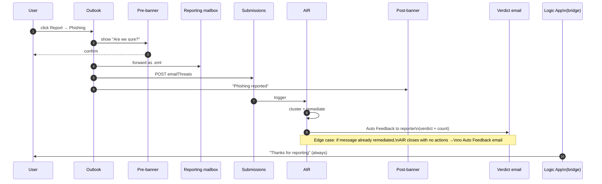

# User-Reported Phishing & Abuse Mailbox Pipeline

> The Microsoft replacement for Proofpoint CLEAR (PhishAlarm + PhishAlarm
> Analyzer + abuse mailbox + TRAP). Most of this is **already in MDO P2
> natively**; the engineering layer is small but specific.

---

## 1. Native vs engineered split

| TRAP/CLEAR feature | Microsoft equivalent | Native or engineered? |
|---|---|---|
| PhishAlarm Outlook button | Built-in Outlook Report button | **Native** |
| Abuse mailbox ingestion | Defender custom reporting mailbox | **Native** |
| Pre-report banner ("are you sure?") | User reported settings → Customise confirmation | **Native** |
| Post-report banner ("Thanks") | User reported settings → Customise success message | **Native** |
| Verdict-back email to reporter | AIR Auto Feedback Response | **Native** (with one edge-case gap) |
| Auto-cluster + tenant-wide auto-pull from one report | AIR investigation graph | **Native** |
| PhishAlarm Analyzer auto-classification | Microsoft AI grader on Submissions | **Native** |
| Custom feedback templates per disposition | User reported settings → Customise messages | **Native** |
| Bulk noise suppression | Microsoft grader returns "No threats found" → no action | **Native** |
| Reporter score / leaderboard | Defender Submissions tab + KQL summary | **Engineered** (small) |
| VAP-aware severity boosting | Sentinel watchlist + automation rule | **Engineered** |
| Hybrid / on-prem mailbox abuse ingestion | Custom Logic App | **Engineered** |
| Always-thank reporter (even when AIR didn't fire) | Logic App bridge | **Engineered** (small) |

---

## 2. Built-in Outlook Report button

Source: [`submissions-outlook-report-messages`](https://learn.microsoft.com/en-us/defender-office-365/submissions-outlook-report-messages),
[Tech Community announcement](https://techcommunity.microsoft.com/blog/microsoftdefenderforoffice365blog/built-in-report-button-is-available-in-microsoft-outlook-across-platforms/4388434).

### Where it ships

| Client | Min version |
|---|---|
| Outlook for Microsoft 365 (Current Channel) | 16.0.17827.15010+ |
| Outlook for Microsoft 365 (Monthly Enterprise) | 16.0.18025.20000+ |
| Outlook for Microsoft 365 (Semi-Annual) | 16.0.18526.20024+ |
| Outlook for Mac | 16.89 (24090815)+ |
| Outlook for iOS | 4.2511+ |
| Outlook for Android | 4.2446+ |
| New Outlook for Windows | All current |
| Outlook on the web | All current |

### What gets sent on click

| User action | Mailbox effect | Submission category |
|---|---|---|
| Report → Phishing | Move to Deleted Items | Phish |
| Report → Junk | Move to Junk; sender added to user's Blocked Senders list | Junk |
| Report → Not junk | Move from Junk → Inbox | Not junk |

When routed to a custom mailbox (not Microsoft), the report arrives with:

* `.eml` or `.msg` attachment of the original
* Headers: `X-Microsoft-Antispam-Message-Info`, `Message-Id`,
  `X-Ms-Exchange-Organization-Network-Message-Id`,
  `X-Ms-Exchange-Crosstenant-Id` (TenantId pivot)
* Subject prefix encodes intent: `1|`/`Junk:`, `2|`/`Not junk:`, `3|`/`Phishing:`

---

## 3. Defender portal configuration

Path: `https://security.microsoft.com/securitysettings/userSubmission`

| Setting | Recommended for TRAP-equivalent |
|---|---|
| Monitor reported messages in Outlook | **ON** |
| Outlook report button configuration | **Use the built-in Report button in Outlook** |
| Send reported items to | **Microsoft and my reporting mailbox** |
| Reporting mailbox | EXO mailbox in same tenant; no DG, no on-prem |
| Ask the user to confirm before reporting | **ON** |
| Show a success message after the message is reported | **ON** |
| Customize messages | Tenant-branded, up to 7 languages, title 50 chars / desc 300 chars / optional info link |
| **Automatically email users the results of the investigation** | **ON** for *Phishing or malware*, *Spam*, *No threats found* |
| Customize results email | Body + footer per verdict |
| Customize sender | `submissions@messaging.microsoft.com` default; override to a SOC alias for branding |
| Allow reporting for quarantined items | **ON** |

PowerShell equivalents: `*-ReportSubmissionPolicy` and
`*-ReportSubmissionRule` (one each per tenant).

---

## 4. Custom reporting mailbox prerequisites

* **EXO mailbox in same tenant.** No distribution groups, no on-prem, no
  external addresses.
* Add to **SecOps mailboxes** in the Advanced Delivery policy
  (`New-SecOpsOverridePolicy`) so spam/phish filtering does not strip the
  report before it reaches the mailbox.
* Exclude from DLP.
* Exclude from journaling and any retention policy that would quarantine
  reports.

---

## 5. Microsoft Graph Submissions API

Source: [`security-emailthreatsubmission-post-emailthreats`](https://learn.microsoft.com/en-us/graph/api/security-emailthreatsubmission-post-emailthreats?view=graph-rest-beta),
[`resources/security-emailthreatsubmission`](https://learn.microsoft.com/en-us/graph/api/resources/security-emailthreatsubmission?view=graph-rest-beta).

### Endpoint

```
POST https://graph.microsoft.com/beta/security/threatSubmission/emailThreats
Authorization: Bearer {token}
Content-Type: application/json
```

> ⚠ Currently `/beta` only. Plan for v1.0 promotion; track release notes.

### Two payload subtypes

```json
// Reference an existing message
{
  "@odata.type": "#microsoft.graph.security.emailUrlThreatSubmission",
  "category": "phishing",
  "recipientEmailAddress": "alice@contoso.com",
  "messageUrl": "https://graph.microsoft.com/beta/users/{userId}/messages/{id}"
}
```

```json
// Upload raw RFC822 (.eml base64)
{
  "@odata.type": "#microsoft.graph.security.emailContentThreatSubmission",
  "category": "phishing",
  "recipientEmailAddress": "alice@contoso.com",
  "fileContent": "<base64 RFC822>"
}
```

`category` enum: `spam | phishing | malware | notSpam`.

Optional `tenantAllowOrBlockListAction` lets the same call create an Allow
or Block TABL entry as a side-effect.

### Permissions

| Type | Least privilege | Higher |
|---|---|---|
| Delegated (work/school) | `ThreatSubmission.ReadWrite` | `ThreatSubmission.ReadWrite.All` |
| Application | `ThreatSubmission.ReadWrite.All` | n/a |

National cloud availability: Global only (no GCC L4/L5/DoD or 21Vianet).

### Throttling

| Limit | Value |
|---|---|
| Submissions / 15-min window | 150 |
| Same submission / 24 h | 3 |
| Same submission / 15 min | 1 |
| Email submissions max age | 30 days (7 days hybrid on-prem) |

### Verdict retrieval

```http
GET /security/threatSubmission/emailThreats/{id}
```

```json
{
  "status": "succeeded",
  "source": "user",
  "result": {
    "detail": "phishing",
    "category": "phishing",
    "userMailboxSetting": "isFromDomainInDomainSafeList",
    "detectedUrls": ["evil.com/login"],
    "detectedFiles": [{ "fileName": "invoice.pdf", "fileHash": "..." }]
  }
}
```

---

## 6. AIR triggering on user reports

Default-enabled alert policy: **`Email reported by user as malware or phish`**
(Medium severity, AIR auto-fires).

### What AIR does

1. Pivots on cluster signals: subject hash, sender (P1+P2), sender domain,
   sender IP, URL host/path, attachment SHA256, Microsoft fingerprint
   matching.
2. Enumerates all matching recipients tenant-wide.
3. Recommends remediation (typically *Soft delete email/cluster*).
4. As of 2025 GA, **auto-approves** malicious-URL and malicious-file
   similarity-cluster remediations. no SOC approval required.
5. Closes investigation; AIR Auto Feedback Response emails the reporter
   the verdict.

### Suppression: beware the alert tuning rule

Microsoft ships a built-in alert tuning rule `Auto-Resolve - Email reported
by user as malware or phish` that **suppresses AIR** if it matches. To
ensure AIR fires:

```powershell
Get-ProtectionAlert |
  Where-Object { $_.Name -like "*Auto-Resolve*Email reported*" } |
  ForEach-Object { Disable-ProtectionAlert -Identity $_.Identity }
```

Verify in the portal at *Email & collaboration → Policies → Alert policy*.

---

## 7. Reporter feedback flow (CLEAR-equivalent)

The MDO native flow does about 90 % of CLEAR. The 10 % gap is bridged by
the Logic App in §8.



---

## 8. Logic App bridges (the engineered ~10 %)

### 8.1 Reporter Thanks Bridge (always-thank)

See [`00-MVP-deployment-guide.md`](./00-MVP-deployment-guide.md) §3.3.
This is the only Logic App in the MVP. It guarantees the reporter
receives an acknowledgement even when AIR's Auto Feedback skips them.

### 8.2 Custom abuse-mailbox ingestion (when not using built-in Report)

For tenants that have legacy `abuse@` mail flowing in from non-Outlook
clients, hybrid on-prem mailboxes, or third-party report buttons:

```
Trigger: Office 365 Outlook → When a new email arrives in shared mailbox (V2)
         (1-min recurrence floor)
Action 1: Filter array, attachments where contentType in ['message/rfc822','application/octet-stream'] and name endswith ('.eml','.msg')
Action 2: For each attached message:
  Action 2a: Compose: base64 of .eml content
  Action 2b: HTTP+MI → POST /beta/security/threatSubmission/emailThreats
              {
                "@odata.type": "#microsoft.graph.security.emailContentThreatSubmission",
                "category": "phishing",
                "recipientEmailAddress": <from message To: header>,
                "fileContent": <base64>
              }
  Action 2c: HTTP+MI → POST /security/runHuntingQuery
              { "Query": "EmailEvents | where InternetMessageId == '<id>' | summarize Recipients=make_set(RecipientEmailAddress)" }
  Action 2d: If recipient count > 0:
              HTTP+MI → Defender XDR Take Action API → soft-delete cluster
Action 3: Office 365 Outlook → Send email V2 to reporter
            "Thanks for reporting; we removed it from N mailboxes."
Action 4: Office 365 Outlook → Move email to Processed folder
```

Setup gotchas:

* `When a new email arrives in shared mailbox (V2)` requires a **per-user
  OAuth connection** (a SOC service mailbox). No service-principal support
  on the Office 365 Outlook connector.
* Pollers run on a recurrence schedule; **1-min recurrence is the floor**.
  Latency is therefore "next minute" not "instant."
* The connection account needs *Send As* and *Read* on the shared mailbox.

### 8.3 Reporter scoreboard (analytics)

```kusto
SecurityAlert
| where TimeGenerated > ago(30d)
| where AlertName == "Email reported by user as malware or phish"
| extend Reporter = tostring(parse_json(ExtendedProperties).["Reporter"])
| extend Verdict = tostring(parse_json(ExtendedProperties).["Verdict"])
| summarize Reports=count(),
            TruePositives = countif(Verdict == "Phish" or Verdict == "Malware"),
            FalsePositives = countif(Verdict == "NoThreatsFound")
       by Reporter
| extend PrecisionPct = round(100.0 * TruePositives / Reports, 1)
| order by Reports desc
```

Surface in a Sentinel workbook for the SOC. Boost
high-precision reporters' alerts (analytics rule with watchlist
`HighPrecision_Reporters`).

---

## 9. VIP / VAP modelling for reporter prioritisation

### 9.1 Microsoft Priority Account Protection (native)

Tag accounts as **Priority account** in Defender → *User tags*. MDO applies
extra heuristics tuned to executive mail flow patterns; the tag is a
filter on Threat Explorer, Submissions, alerts, the Email entity page,
and Campaigns. Source: [`priority-accounts-turn-on-priority-account-protection`](https://learn.microsoft.com/en-us/defender-office-365/priority-accounts-turn-on-priority-account-protection).

### 9.2 Sentinel watchlist for VAP

Build `VAP_Users` from:

* MDI risky-user list
* Microsoft Priority Accounts
* HR-supplied executive title list
* Defender XDR Insider Risk signals

Then in an analytics rule:

```kusto
let VAP = _GetWatchlist('VAP_Users') | project UserPrincipalName;
SecurityAlert
| where AlertName == "Email reported by user as malware or phish"
| extend Reporter = tostring(parse_json(ExtendedProperties).["Reporter"])
| where Reporter in (VAP)
| extend Severity = "High"
```

Wire to an automation rule that bumps incident severity and pages a
dedicated VAP responder.

---

## 10. Bulk admin submission

* Defender → *Submissions → Email → Submit to Microsoft → Bulk* (CSV upload).
* PowerShell loop using Graph beta SDK:

```powershell
Connect-MgGraph -Scopes "ThreatSubmission.ReadWrite.All"
Import-Csv .\suspicious.csv | ForEach-Object {
  $body = @{
    "@odata.type" = "#microsoft.graph.security.emailUrlThreatSubmission"
    category = "phishing"
    recipientEmailAddress = $_.Recipient
    messageUrl = "https://graph.microsoft.com/beta/users/$($_.RecipientId)/messages/$($_.MessageId)"
  } | ConvertTo-Json -Depth 5
  Invoke-MgGraphRequest -Method POST `
    -Uri "/beta/security/threatSubmission/emailThreats" `
    -Body $body -Headers @{ "Content-Type" = "application/json" }
  Start-Sleep -Milliseconds 500   # respect 150/15-min throttle
}
```

---

## 11. Operational gaps relative to TRAP/CLEAR

| Capability | TRAP/CLEAR | MDO native | Bridge |
|---|---|---|---|
| Reporter "thanks" depth | Always sent on every disposition | One terminal Auto Feedback email; not sent if already remediated | Logic App Reporter Thanks Bridge (§8.1) |
| Manual AIR trigger from API | Native | No `Trigger-AIRInvestigation` cmdlet; no Graph endpoint | Submit via Graph emailThreats POST → alert fires AIR |
| GCC/GCC High/DoD support | Yes | Submissions API not available; *Send to Microsoft* not allowed | Custom mailbox only path |
| Spoof/Phish/Spam/Clean disposition gradient | Finer-grained | 4 verdicts (Phish/Spam/No-threat for email) | Live with it; map TRAP labels to MDO verdicts |
| On-prem hybrid abuse mailbox | Native | Built-in button does not support delegate scenarios on on-prem mailboxes | Logic App polling pattern (§8.2) |
| Bulk admin CSV submission in portal | Native | Not in portal UI; scripted via PowerShell | Acceptable workaround (§10) |
