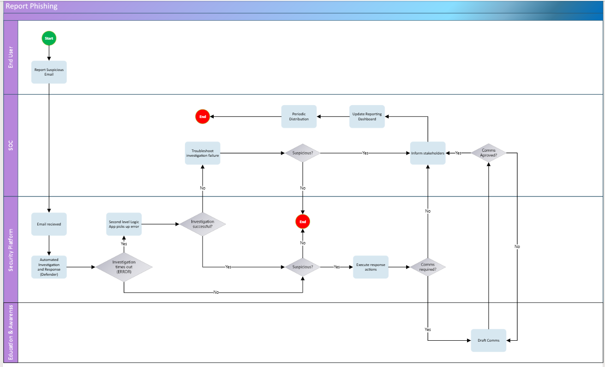
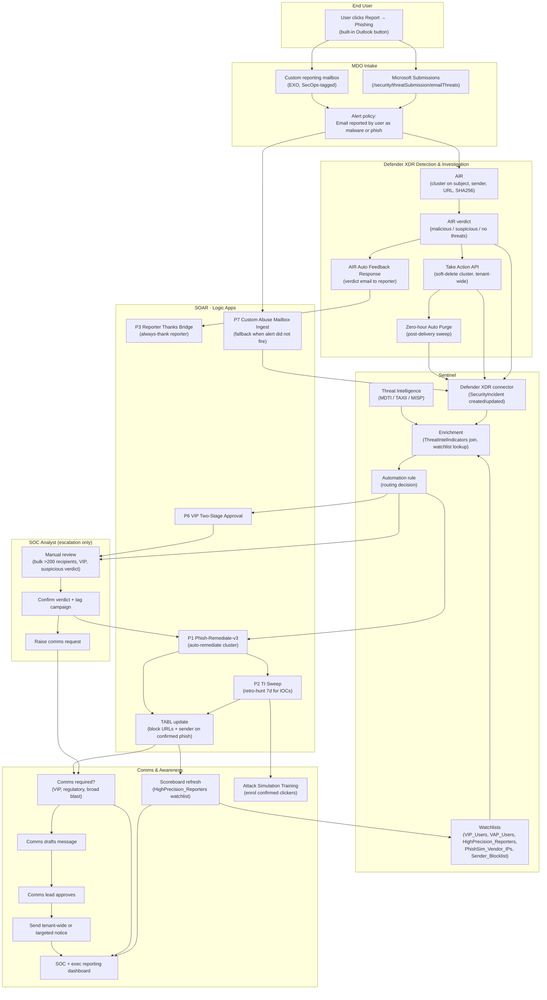

# Phishing Reporting and Response Flowchart

> Production-shaped end-to-end flow for user-reported phishing on the
> MDO + Defender XDR + Sentinel + Logic Apps stack. Every node in the
> diagram maps to a capability that already exists in MDO Plan 2, in
> Defender XDR, in Sentinel, or in a playbook we have already specified
> in [`10-logic-apps-playbook-library.md`](./10-logic-apps-playbook-library.md).
> Nothing in this document is invented. Where a capability is referenced
> we link to the primary Microsoft Learn source the first time it
> appears.

---

## 1. Why we are redrawing the flow

We were handed a draft "Report Phishing" swim-lane diagram (End User →
Security Platform → SOC → Education & Awareness):



It has the right shape but several gaps we need to close before we can
run this in production:

| Issue in the draft | What we are changing |
|---|---|
| Two `Suspicious?` decision diamonds (one in Security Platform, one in SOC) with no clear owner | Single verdict comes from AIR. SOC only sees it on escalation. |
| `Second level Logic App picks up error` is undefined | Replaced with an explicit "AIR did-not-fire" branch, triggered by an alert-tuning audit query (see §6). |
| `Investigation times out (ERROR)` treated as the only failure mode | Three explicit failure modes: AIR suppressed by an alert tuning rule, AIR did not fire (no alert), AIR fired but returned no remediation. Each has its own fallback path. |
| No threat-intel enrichment | Every confirmed-phish path now writes IOCs back to the Tenant Allow/Block List (TABL) and joins against `ThreatIntelIndicators` for cross-tenant correlation. |
| No watchlist application | VIP / VAP / High-precision-reporter / PhishSim-vendor watchlists are applied at the Sentinel incident layer to drive severity and approval routing. |
| No reporter feedback shown | AIR Auto Feedback Response is the primary acknowledgement; the Reporter Thanks Bridge Logic App (P3) covers the edge case where AIR closes silently. |
| `Education & Awareness` lane only contained `Draft Comms` | Education lane now covers reporter scoreboard updates, Attack Simulation Training enrolment for confirmed clickers, and stakeholder comms with approval handled in the comms lane (not in SOC). |
| `Comms Approved?` decision lived in SOC lane | Moved to the Comms & Awareness lane. SOC raises the request, Comms own the decision. |
| No Sentinel incident creation visible | Defender XDR connector creates the incident. All SOC and SOAR steps hang off the Sentinel incident, not off the raw alert. |

**Why this matters:** the running test in the Strict-preset pilot has
already shown that EmailEvents populates and the Campaigns alert is
visible (see [[project_mdo_licensing_gap]]). That confirms MDO P2 is
present, so the diagram below is what we will be wiring up on top of
that licensing baseline once Phase 0's per-mailbox P2 audit is signed
off.

---

## 2. The end-to-end flow

Swim lanes:

* **End User** — Outlook (any platform supporting the built-in Report
  button per [`08-abuse-mailbox-and-user-reporting.md`](./08-abuse-mailbox-and-user-reporting.md) §2).
* **MDO + Defender XDR** — automated detection and remediation path.
* **Sentinel** — incident creation, enrichment, analytics, watchlists,
  threat intel.
* **SOAR (Logic Apps)** — orchestration; the playbooks already specced
  in [`10-logic-apps-playbook-library.md`](./10-logic-apps-playbook-library.md).
* **SOC Analyst** — only on escalation (AIR-skipped, VIP-flagged, or
  bulk-recipient cases).
* **Comms & Awareness** — stakeholder comms, scoreboard, training
  enrolment.



---

## 3. Decision points, explained

### 3.1 Did the alert policy fire?

The default-enabled alert policy **`Email reported by user as malware or
phish`** is what makes AIR auto-fire on submissions
([source](https://learn.microsoft.com/en-us/defender-office-365/alert-policies-defender-portal)).
Two things can stop it firing:

1. The built-in tuning rule `Auto-Resolve - Email reported by user as
   malware or phish` suppresses it. We disable that rule in Phase 1
   (procedure documented in [`08-abuse-mailbox-and-user-reporting.md`](./08-abuse-mailbox-and-user-reporting.md) §6).
2. The submission did not reach Microsoft (custom mailbox-only path in
   GCC / GCC High, or a Logic App pickup that did not POST to the
   Submissions API).

For both, we fall straight into the Sentinel lane and let P1 run
without an AIR verdict to chain off. The KQL audit query that finds
"submission without AIR" lives in
[`09-kql-detection-library.md`](./09-kql-detection-library.md).

### 3.2 AIR verdict branching

AIR returns one of: malicious, suspicious, no threats found
([Office 365 AIR overview](https://learn.microsoft.com/en-us/defender-office-365/air-about)).

* **Malicious** → auto-approved cluster soft-delete via the Defender
  XDR Take Action API (per [`05-defender-xdr-air-zap.md`](./05-defender-xdr-air-zap.md)
  and [`07-graph-and-exchange-remediation.md`](./07-graph-and-exchange-remediation.md)).
* **Suspicious** → no auto-action; Sentinel incident gets created
  anyway and P1 runs in approval mode (SOC confirms before any
  delete).
* **No threats found** → AIR closes; the only outbound step is the
  reporter acknowledgement via P3. We do not create a Sentinel incident
  for clean verdicts (noise control).

### 3.3 Routing decision in Sentinel

A single Sentinel automation rule reads the enriched incident and
chooses one of three exits, based on
[`06-sentinel-soar-orchestration.md`](./06-sentinel-soar-orchestration.md)
§3 and the watchlists in §4 of that same doc:

| Condition | Route |
|---|---|
| `RecipientCount > 200` OR `VIP recipient match` OR analyst-only verdict (suspicious without auto-action) | SOC lane for manual confirmation, then P1 with explicit approval |
| `VIP recipient` OR `VAP reporter` match | P6 two-stage approval playbook |
| All other malicious verdicts | P1 direct |

The 200-recipient threshold is the Defender XDR Take Action versus
Compliance Search cut-over already documented in
[`07-graph-and-exchange-remediation.md`](./07-graph-and-exchange-remediation.md).

### 3.4 Comms required?

Owned by the Comms & Awareness lane, not SOC. The criteria
(VIP-targeted, more than N recipients, regulatory data implicated) live
in our incident-response runbook; the diagram only shows the decision
shape, not the rules.

---

## 4. Threat intelligence hooks

All three TI ingestion paths supported by Sentinel (per
[`06-sentinel-soar-orchestration.md`](./06-sentinel-soar-orchestration.md)
§1.3) are reachable from this flow:

| TI source | Where it joins the flow |
|---|---|
| **MDTI** (Microsoft Defender Threat Intelligence) | Drives the built-in `Microsoft Threat Intelligence Analytics` matching rule. Hits from this rule attach to the same Sentinel incident as the user report when the URL or sender matches. |
| **TAXII 2.x feeds** | Polled into `ThreatIntelIndicators`. The Sentinel enrichment step (S2 in §2) joins email URLs and SHA256 hashes against this table at incident creation. |
| **MISP** via `MISP2Sentinel` | Same target table as TAXII; treated identically by the enrichment step. |
| **Direct REST upload** (STIX 2.1) | Used for one-off IOC bundles from incident-response engagements. |

On a confirmed-phish verdict from AIR, the **TABL update** step (L5 in
the diagram) writes the URL hosts and sender address back into the
tenant block list via Graph
([`tenantAllowBlockListEntries`](https://learn.microsoft.com/en-us/graph/api/security-tenantallowblocklistentries-post-tenantallowblocklistentries)).
That closes the loop: future deliveries hitting the same IOC get
blocked at EOP before they reach a mailbox.

---

## 5. Watchlist application

The four watchlists this flow depends on are all already in our
recommended set in [`06-sentinel-soar-orchestration.md`](./06-sentinel-soar-orchestration.md)
§4:

| Watchlist | Where it is read | Effect |
|---|---|---|
| `VIP_Users` | S2 enrichment, S3 routing | Routes the incident to P6 two-stage approval; bumps severity. |
| `VAP_Users` | S2 enrichment, S3 routing | Same routing as VIP; built from MDI risky-user list + Priority Accounts + HR exec list (per [`08-abuse-mailbox-and-user-reporting.md`](./08-abuse-mailbox-and-user-reporting.md) §9.2). |
| `HighPrecision_Reporters` | S2 enrichment, C5 update | High-precision reporters' submissions are weighted up at routing time (severity boost). Scoreboard updates this watchlist nightly. See §5.1 for the definition. |
| `PhishSim_Vendor_IPs` | S2 enrichment | Excludes Cofense / KnowBe4 simulation senders from AIR auto-action so we do not soft-delete our own training campaigns. |
| `Sender_Blocklist` | S2 enrichment | Confirmed-phish senders get appended here for cross-incident correlation; also the source for the TABL refresh job. |

Watchlist updates remain **replace-style** (no append-row API per the
Sentinel docs); the nightly refresh runs as a Logic App that writes a
fresh CSV to blob storage and re-points the watchlist.

### 5.1 What a "high-precision reporter" is

A high-precision reporter is a user whose past phishing submissions
have a high true-positive rate against the Microsoft grader. They are
the inverse of a noise reporter: when they click Report → Phishing, the
message is much more likely to actually be phishing than the
tenant-wide baseline. We treat them as a soft signal that boosts
incident severity and shortens the time-to-action.

**How we measure precision.** Each reporter's score comes from the
scoreboard KQL already in
[`08-abuse-mailbox-and-user-reporting.md`](./08-abuse-mailbox-and-user-reporting.md) §8.3.
The shape is:

```text
PrecisionPct = TruePositives / Reports
             = countif(Verdict in ('Phish','Malware'))
               / count(Reports in last 30 days)
```

Verdict comes from the `Email reported by user as malware or phish`
alert's `ExtendedProperties.Verdict` field, which Microsoft fills in
after the grader and AIR run. So precision is *Microsoft's* judgement
of the reporter, not ours.

**Inclusion thresholds for the watchlist.** We will tune these in
Phase 2 of the parallel run, but the starting defaults are:

| Field | Threshold | Why |
|---|---|---|
| `Reports` in last 30 d | ≥ 5 | Avoid promoting users who reported once and got lucky. |
| `PrecisionPct` | ≥ 70 % | Comfortably above the tenant baseline (typically 15 to 30 % for general staff). |
| `FalsePositives` | ≤ 3 | Caps noise contribution. |
| Last report `TimeGenerated` | ≤ 30 d | Stale reporters drop off. |

A user who clears all four lands in `HighPrecision_Reporters`. The
nightly refresh Logic App re-runs the scoreboard query, builds a fresh
CSV, and re-points the watchlist (replace-style update per the limits
in [`06-sentinel-soar-orchestration.md`](./06-sentinel-soar-orchestration.md) §4).

**What changes for an incident when the reporter is on the list.**
Three things, all in the Sentinel automation rule:

1. Incident severity bumps one tier (Low → Medium, Medium → High).
   Documented in our automation-rule design in
   [`06-sentinel-soar-orchestration.md`](./06-sentinel-soar-orchestration.md).
2. SLA timer for first SOC touch shortens (target defined in the
   incident-response runbook, not in this repo).
3. The Sentinel routing decision (S3 in §2) is more likely to take
   the P1 direct-remediate exit instead of waiting for AIR's
   suspicious-verdict path to clear.

**What it does not do.** Being a high-precision reporter does not
auto-confirm the verdict, does not skip AIR, and does not bypass VIP
approval. It is a prior, not a decision.

**Anti-gaming notes.**

* The list is read-only outside the nightly refresh. SOC cannot add a
  user by hand. (Avoids favouritism creep.)
* PhishSim vendor traffic is excluded by the
  `PhishSim_Vendor_IPs` watchlist before the scoreboard runs, so a
  user who reports a training campaign correctly does not get
  artificially inflated precision.
* `Reporter = Recipient` cases (self-reported) are kept; we do not
  filter them, but we flag them in the scoreboard workbook for review.

---

## 6. Failure and fallback paths

Three failure modes and what catches each:

| Failure | Catch |
|---|---|
| AIR alert was suppressed by tuning rule | Phase 1 audit step disables the rule (per [`08-abuse-mailbox-and-user-reporting.md`](./08-abuse-mailbox-and-user-reporting.md) §6). KQL drift-detector in [`09-kql-detection-library.md`](./09-kql-detection-library.md) raises an incident if the rule re-appears. |
| Submission reached Microsoft but no alert fired (e.g., Microsoft grader returned "No threats found" and the message was clean) | P3 still acknowledges the reporter. No Sentinel incident. This is the desired outcome for low-noise reporting. |
| Submission did not reach Microsoft (custom mailbox-only path) | P7 Custom Abuse Mailbox Ingest (already specced in [`10-logic-apps-playbook-library.md`](./10-logic-apps-playbook-library.md)) polls the mailbox, POSTs to the Submissions API, and falls back to a direct hunting query + Take Action call if the submission itself fails. |

---

## 7. What this flow does not do (and why)

* **No automatic hard-delete.** Every remediation node is soft-delete
  (Recoverable Items). Hard-delete is reserved for the manual
  Compliance Search path, never a playbook, per the conservative
  defaults documented in the `automation/logic-apps/` ARM templates.
* **No automatic password reset or account isolation on click.** The
  click-correlation hunt (Q2 in [`09-kql-detection-library.md`](./09-kql-detection-library.md))
  raises a follow-up incident; the response sits in the Defender for
  Endpoint / Entra ID playbooks, not this one. Kept explicit so we do
  not duplicate-trigger.
* **No outbound notification to external third parties** (vendors,
  partners) without Comms lane approval. The flow can produce the
  message; it cannot send it without C3.
* **No verdict override from Sentinel back into MDO.** If SOC
  disagrees with the AIR verdict, the correction goes through
  Submissions (admin submission with corrected category), not by
  mutating the Defender XDR alert directly. That keeps the Microsoft
  grader's training set honest.

---

## 8. How this maps to the rest of the blueprint

| Step in this flow | Reference doc |
|---|---|
| Built-in Report button, custom mailbox, Submissions API | [`08-abuse-mailbox-and-user-reporting.md`](./08-abuse-mailbox-and-user-reporting.md) |
| AIR cluster behaviour, Take Action API, ZAP | [`05-defender-xdr-air-zap.md`](./05-defender-xdr-air-zap.md) |
| Sentinel incident creation, watchlists, TI joins | [`06-sentinel-soar-orchestration.md`](./06-sentinel-soar-orchestration.md) |
| Graph remediation endpoints, Compliance Search fallback | [`07-graph-and-exchange-remediation.md`](./07-graph-and-exchange-remediation.md) |
| KQL queries powering enrichment and audit | [`09-kql-detection-library.md`](./09-kql-detection-library.md) |
| P1, P2, P3, P6, P7 playbook designs | [`10-logic-apps-playbook-library.md`](./10-logic-apps-playbook-library.md) |
| ARM templates for the playbooks | [`automation/logic-apps/`](./automation/logic-apps/) |
| Phase ordering for delivery | [`11-implementation-roadmap.md`](./11-implementation-roadmap.md) |

If a node in §2 is not on this map, treat that as a bug in the
diagram and raise it in [`14-open-questions.md`](./14-open-questions.md).
