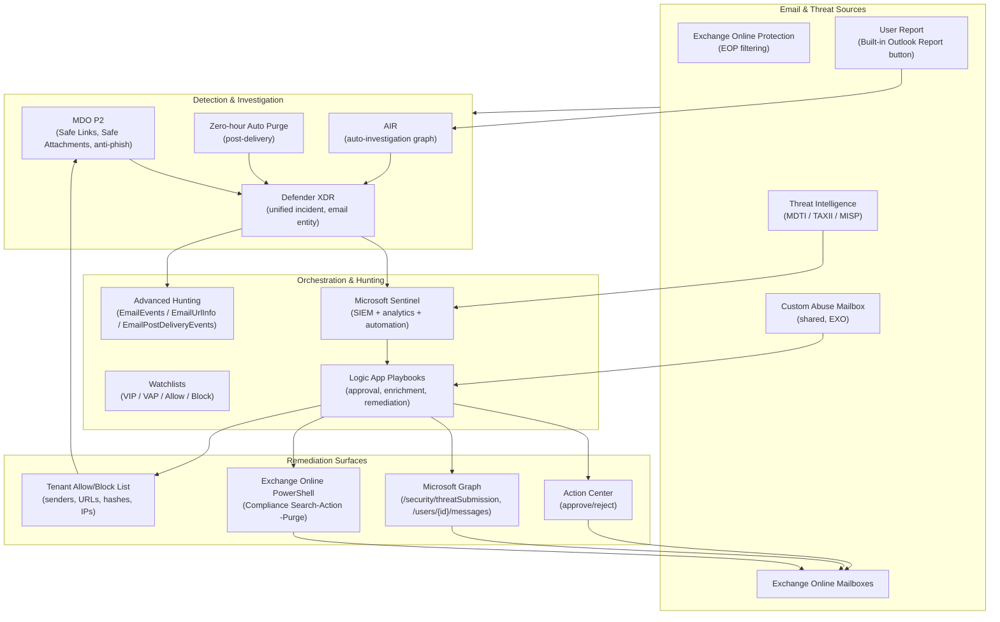

# Proofpoint TRAP to Microsoft Defender for Office 365 Migration Blueprint

Architecture blueprint for replacing Proofpoint Threat Response Auto-Pull
(TRAP) with Microsoft Defender for Office 365 (MDO), Defender XDR, and
Microsoft Sentinel. Written for security architects, detection engineers,
SOAR engineers, and Exchange admins. Implementation-grade detail; not a
product comparison.

## The verdict

About 85 percent of TRAP's operational outcomes ship in MDO P2 with policy
configuration only. Another 10 percent needs custom Logic App and KQL
work. Two capabilities cannot be matched: remediating external forwarded
copies, and a single-action remediation across multiple tenants. Both
have honest workarounds documented here.

## Read this first

[**00-MDO-out-of-the-box-deployment-guide.md**](./00-MDO-out-of-the-box-deployment-guide.md) lists the
native MDO behaviours that cover most of TRAP's outcomes with no
engineering. Start there. The rest of this blueprint covers the engineered
gap-closers and the migration sequencing.

## Documents

| # | Document | Purpose |
|---|----------|---------|
| 00 | **[MDO Out-of-the-box Deployment Guide](./00-MDO-out-of-the-box-deployment-guide.md)** | **What ships natively in MDO. The all-config, no-engineering baseline. Read first.** |
| 01 | [Executive Summary](./01-executive-summary.md) | One-page summary, capability verdict, headline costs, headline gaps |
| 02 | [Target-State Architecture](./02-architecture-overview.md) | High-level system, data, control, and remediation flow diagrams |
| 03 | [TRAP → MDO Capability Matrix](./03-trap-capability-matrix.md) | Feature-by-feature parity table with native / partial / workaround / impossible verdicts |
| 04 | [MDO Native Capabilities Deep Dive](./04-mdo-native-capabilities.md) | What MDO P1, P2, and Defender XDR provide out of the box |
| 05 | [Defender XDR, AIR, ZAP](./05-defender-xdr-air-zap.md) | Auto-investigation graph, eligible action set, ZAP fundamentals |
| 06 | [Sentinel SOAR Orchestration](./06-sentinel-soar-orchestration.md) | Sentinel analytics, automation rules, playbooks, watchlists, TI |
| 07 | [Graph API + Exchange Remediation](./07-graph-and-exchange-remediation.md) | Programmatic remediation: Graph, EXO PowerShell, Compliance Search |
| 08 | [User-Reported Phishing Pipeline](./08-abuse-mailbox-and-user-reporting.md) | Built-in Report button, Submissions API, custom abuse mailbox via Logic Apps |
| 09 | [KQL Detection Library](./09-kql-detection-library.md) | Production-grade KQL for campaign clustering, forward-tracking, DL expansion, IOC hunting |
| 10 | [Logic App Playbook Library](./10-logic-apps-playbook-library.md) | Reference playbook designs in ARM/JSON-shaped pseudocode |
| 11 | [Implementation Roadmap](./11-implementation-roadmap.md) | Phased migration plan (parallel run → cutover → decommission), with success criteria |
| 12 | [Limitations, Gaps, and Workarounds](./12-limitations-and-gaps.md) | Honest catalogue of what cannot be matched, why, and the closest workaround |
| 13 | [Licensing and Operational Considerations](./13-licensing-and-operations.md) | What SKUs we must hold, what tier each capability requires, ongoing operational cost |
| 14 | [Open Questions](./14-open-questions.md) | Running list of unresolved decisions: on-prem and hybrid scope, the new Mail-Advanced.ReadWrite scope, our actual MDO licensing, and other items that can change project shape |

Suggested reading order: 00 (OOTB deployment), 01 (executive summary), 02
(architecture), 03 (capability matrix), 14 (open questions). The rest is
reference material the roadmap calls for in sequence.

---

## Glossary

The acronyms used across this blueprint, expanded once here so individual
docs can stay readable. We do not re-expand the well-known industry terms
(SIEM, SOAR, XDR, SHA, API, HTTP, REST, JSON, URL, UI, IP, SMTP, DNS,
SOC, VIP, MFA, OAuth) on every use.

| Acronym | Expansion |
|---|---|
| AIR | Automated Investigation and Response (a Microsoft Defender for Office 365 Plan 2 capability) |
| ARM | Azure Resource Manager |
| CA | Conditional Access |
| CLEAR | Closed-Loop Email Analysis and Response (Proofpoint) |
| DL | Distribution List |
| DLP | Data Loss Prevention |
| EOP | Exchange Online Protection |
| EWS | Exchange Web Services (Microsoft, retiring in EXO October 2026) |
| EXO | Exchange Online |
| GDAP | Granular Delegated Admin Privileges |
| IOC | Indicator of Compromise |
| IRM | Information Rights Management |
| KQL | Kusto Query Language |
| LAW | Log Analytics Workspace |
| MDI | Microsoft Defender for Identity |
| MDO | Microsoft Defender for Office 365 |
| MDTI | Microsoft Defender Threat Intelligence |
| MI | Managed Identity |
| MIP | Microsoft Information Protection |
| MISP | Malware Information Sharing Platform |
| MSSP | Managed Security Service Provider |
| MTTR | Mean Time To Remediate |
| NRT | Near Real Time (a Sentinel analytics rule type) |
| OOTB | Out-of-the-box |
| PTR | Proofpoint Threat Response |
| RBAC | Role-Based Access Control |
| STIX | Structured Threat Information Expression |
| TABL | Tenant Allow/Block List (Microsoft) |
| TAP | Targeted Attack Protection (Proofpoint) |
| TAXII | Trusted Automated Exchange of Indicator Information |
| TI | Threat Intelligence |
| TRAP | Threat Response Auto-Pull (Proofpoint) |
| UAL | Unified Audit Log (Microsoft) |
| UAMI | User-Assigned Managed Identity |
| UEBA | User and Entity Behaviour Analytics |
| UPN | User Principal Name |
| VAP | Very Attacked People (Proofpoint terminology, reused as a Sentinel watchlist) |
| ZAP | Zero-hour Auto Purge (a Microsoft Defender for Office 365 capability) |

---

## Capability headline

| TRAP capability | MDO + ecosystem verdict |
|---|---|
| Post-delivery remediation (delete from mailboxes) | **Native**: AIR + Defender XDR Take Action + Compliance Search-Action |
| Auto-pull from user-reported phish | **Native**: User-reported AIR auto-investigation |
| Forward-following remediation | **Engineered**: KQL on `EmailEvents` + recursive Get-MessageTraceV2 |
| Distribution-list expansion | **Engineered**: `Get-DistributionGroupMember` recursion + Compliance Search by recipient set |
| Abuse mailbox ingestion (custom) | **Native**: Defender custom reporting mailbox + Submissions API |
| Campaign clustering | **Native (P2)** + KQL augmentation in Sentinel |
| Reporter "thanks" + verdict feedback | **Partial**: built-in pre/post banners; verdict feedback requires Logic App |
| Read-status visibility for reported messages | **Engineered**: Graph `/messages?$select=isRead` per recipient |
| Cross-tenant investigation | **Impossible** in single deployment; requires Lighthouse / per-tenant deployment |
| Auto-remediation approval workflow | **Native**: Defender Action Center + Sentinel automation rules |
| Audit trail of every pull | **Native**: Unified Audit Log + Action Center + Sentinel `OfficeActivity` |
| SIEM forwarding of incidents | **Native**: Sentinel is the SIEM; XDR streaming connector |
| Threat-intelligence-driven retroactive sweeps | **Native**: Sentinel TI + scheduled hunting rules |

Full matrix in [`03-trap-capability-matrix.md`](./03-trap-capability-matrix.md).

---

## Architecture in one diagram

The control plane is **Sentinel + Logic App playbooks**: The data plane for
remediation is **Graph + Compliance Search-Action + Defender XDR Take Action**.
The detection plane is **MDO + AIR + ZAP feeding Defender XDR incidents** that
stream to Sentinel.

---

## Authoring conventions

* All factual claims that depend on Microsoft or Proofpoint behaviour cite the
  primary source inline. We do not paraphrase undocumented behaviour without
  marking it as undocumented.
* Mermaid diagrams are kept in source. Render in any viewer that supports
  GitHub-flavoured Mermaid.
* KQL is targeted at the Sentinel / Defender XDR Advanced Hunting unified
  schema, not legacy MDATP-only schema.
* PowerShell snippets target Exchange Online Management v3+, Microsoft Graph
  PowerShell SDK v2+, and Security & Compliance PowerShell.
* Every Logic App playbook example is presented as an action graph; full ARM
  templates are out of scope for this document but pointers to upstream
  examples in `Azure/Azure-Sentinel` are given.

---

## Out of scope

* Migration of Proofpoint TAP detection policies. (TAP detection moves to MDO
  policies; that is a configuration-mapping exercise, not an architecture
  problem.)
* Migration of Email Protection (Proofpoint EOP-equivalent gateway). The MDO
  side already terminates SMTP at EOP. this is assumed.
* Email DLP. Microsoft Purview DLP is the equivalent and is treated as a
  separate workstream.
* Email encryption (Proofpoint Encryption → Microsoft Purview Message
  Encryption).

These are referenced where they intersect remediation but not designed in
detail.
